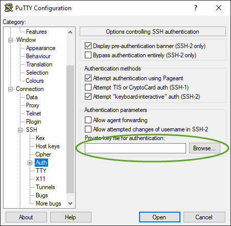
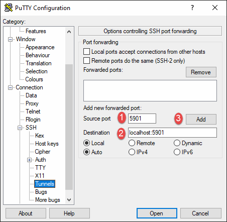

# Connect to your new environment

Note that you *can* connect vnc viewer directly to the instance on port 5901 without doing the following, but the traffic is not encrypted! Use that method only to verify the VNC connection works.

1. Run PuTTY.
1. Enter the hostname (if you set up Route53 DNS) or public IP of the instance if you did not.

1. Select **Connection/Data** from the tree menu on the left and enter the Linux username you provided to packer.

1. Expand **Connection/SSH** in the tree menu, click on **Auth** then browse to the `.ppk` file you created above.

1. Click on **Tunnels** and configure the tunnel for VNC.spacing for image align

1. Press **Open** button at the bottom. This should establish a terminal session with the instance, and at the same time set up the tunnel for VNC
1. Run the Tiger VNC client. Enter `localhost:5901` in the **VNC Server** field, then press connect

1. If you're using a Route53 DNS record, and entered the hostname in step 3 above, then you should save the PuTTY session for reuse.

**Next**: [Parking/Reusing your instance](./park.md)