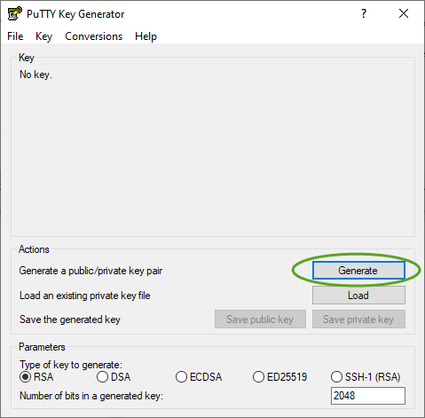
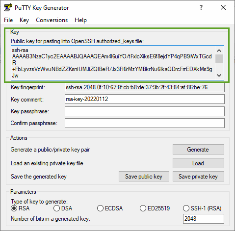
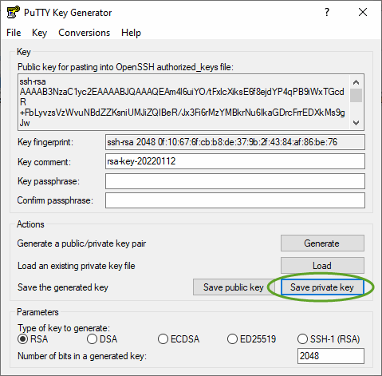

# Generate Key Pair

How to create a key pair for your instance using PuTTYgen

1. Open PuTTYgen and press the **Generate** button. Follow the instructions

1. Select and copy the public key from the box indicated here. Paste this into a text editor and save to a file e.g. `devenv.pub`. The path to this file will be one of the inputs to the packer build. Ensure you've selected it all (about 400 characters).

1. Press **Save private key** button. This will save the private key as a `.ppk` file. It will warn you about not having a passphrase, but this is OK.  You will need this file when making an SSH connection to the new instance with PuTTY.

* [Next](./ami.md) - Build the AMI